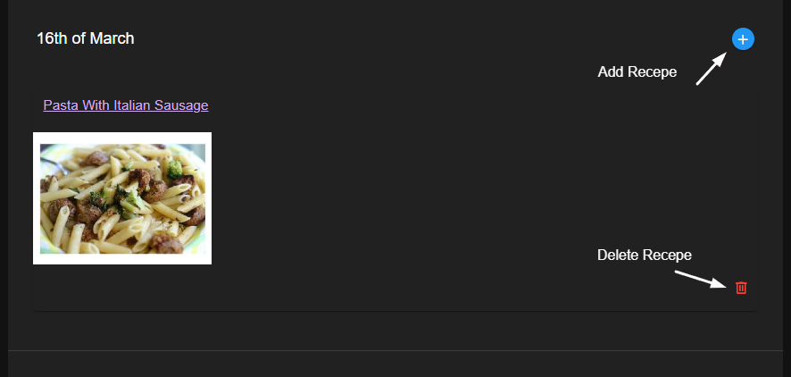
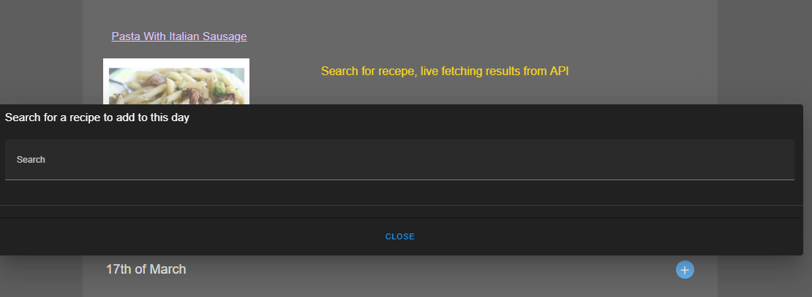
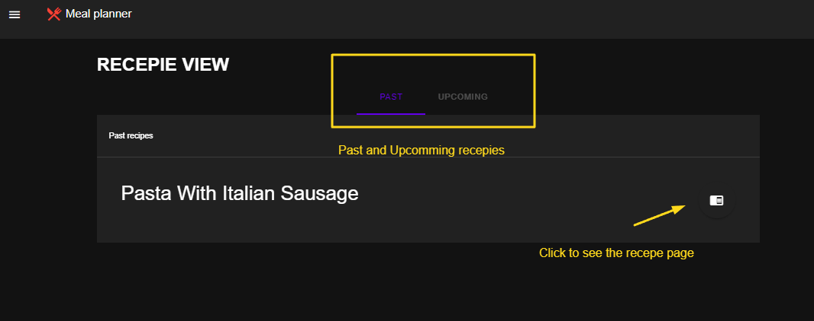

# superhero-app

Meal planner where you can browse recipes to add them to a weekly calendar
This project is simple app that is fetching data from Food Recepies Api.  
Data is locally stored inside LocalStorage.

---

## Tchnologies
- Vue 3
- Vue-Router
- Vuetifyjs
- Vite
- Pinia


## Recommended IDE Setup

[VSCode](https://code.visualstudio.com/) 

## Customize configuration

See [Vite Configuration Reference](https://vitejs.dev/config/).

## Project Setup

```sh
npm install
```

### Compile and Hot-Reload for Development

```sh
npm run dev
```

### Compile and Minify for Production

```sh
npm run build
```






